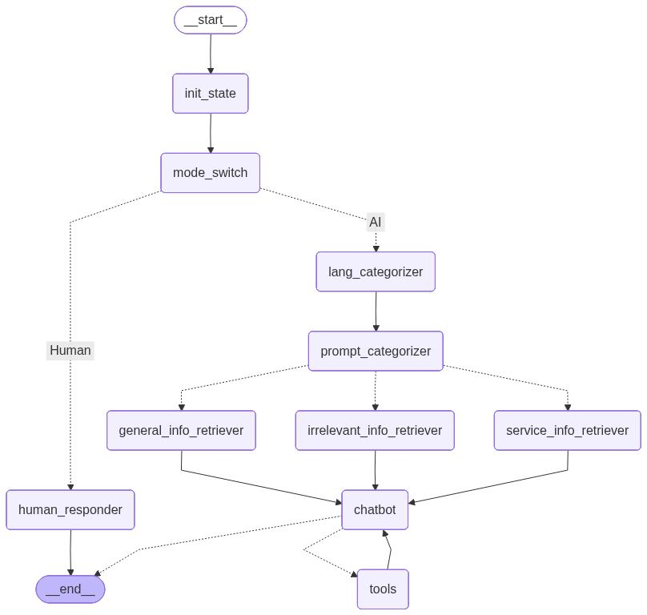

# Multi-Prompt RAG Agent for Chamak Bangladesh

An intelligent customer support agent built using LangGraph and RAG (Retrieval-Augmented Generation) to handle customer queries for Chamak Bangladesh, a premium home cleaning service company.



## Overview

This project implements a sophisticated conversational AI agent that can handle multiple types of customer queries with contextual awareness, multi-language support (English and Bangla), and intelligent routing. The agent uses vector databases to retrieve relevant information and provides accurate responses about Chamak's services.

## Features

- **Multi-Category Query Handling**: Automatically categorizes queries into irrelevant, general, or service-specific queries
- **Dual Language Support**: Responds in English or Bangla based on user's language preference
- **RAG-Powered Responses**: Retrieves relevant information from vector databases for accurate answers
- **Order Management**: Collects customer information and saves orders to CSV using tool calling
- **Mode Switching**: Toggle between AI and human agent modes
- **Conversation Memory**: Maintains context across conversation using checkpointer
- **Multi-Source Knowledge Base**: Separate vector stores for general and service-specific information

## Architecture

The agent uses a state graph with the following components:

1. **Initialization**: Sets up auto mode by default
2. **Mode Switching**: Routes to AI or human agent based on mode
3. **Language Categorizer**: Detects user's language (English/Bangla/Neutral)
4. **Prompt Categorizer**: Classifies queries into three categories
5. **Information Retrievers**: Three specialized retrievers for different query types
6. **Chatbot**: Generates contextual responses using retrieved information
7. **Tool Node**: Handles order saving functionality

## Project Structure
```
multi_prompt_RAG_agent/
├── Multi_promt_agent.ipynb          # Main Jupyter notebook with agent implementation
├── vectorDB_create.py                # Script to create vector databases from PDFs
├── chamak_contacts.csv               # CSV file storing customer orders
├── Company Knowledge Files (General)/
│   └── General.pdf                   # General company information
├── Company Knowledge Files (Service)/
│   └── Services.pdf                  # Service-specific details
└── Multi_Prompt_RAG_Agent.png        # Architecture diagram
```

## Prerequisites

- Python 3.8+
- OpenAI API Key
- Required packages (see Installation)

## Installation

1. Clone the repository:
```bash
git clone <repository-url>
cd multi_prompt_RAG_agent
```

2. Install required packages:
```bash
pip install langchain langchain-community langchain-openai langchain-chroma
pip install langgraph typing-extensions python-dotenv
pip install pypdf chromadb
pip install ipython
```

3. Set up environment variables:
Create a `.env` file in the project root:
```env
MY_OPENAI_KEY=your_openai_api_key_here
```

## Setup

### 1. Create Vector Databases

Before running the agent, you need to create vector databases from your knowledge base:
```bash
python vectorDB_create.py
```

**Note**: Update the following in `vectorDB_create.py`:
- Line 12: Replace `--Company knowledge Files Directory Name--` with your actual folder name
- Line 91: Replace `--Your Knowlege Base Directory Name that will be created--` with desired vector DB name

The script will:
- Load PDF and text files from the knowledge base directory
- Split documents into chunks (512 characters with 60 character overlap)
- Create embeddings using OpenAI's `text-embedding-3-small` model
- Persist the vector database to disk

### 2. Run the Agent

Open and run the Jupyter notebook:
```bash
jupyter notebook Multi_promt_agent.ipynb
```

Or convert to Python script and run:
```bash
jupyter nbconvert --to script Multi_promt_agent.ipynb
python Multi_promt_agent.py
```

## Usage

### Basic Interaction
```python
# Initialize the agent
query = "What services does Chamak provide?"
result = run_customer_support(query)

print(f"Response: {result['messages'][-1].content}")
```

### Mode Switching

The agent supports two modes:

- **Auto Mode (AI)**: Default mode where AI handles all queries
- **Manual Mode (Human)**: Routes queries to human agents

Switch modes by sending:
```python
# Switch to manual mode
run_customer_support("/manual")

# Switch back to auto mode
run_customer_support("/auto")
```

### Language Detection

The agent automatically detects the language and responds accordingly:
- English queries → English responses
- Bangla queries → Bangla responses  
- Neutral queries (numbers, yes/no) → Maintains previous language

### Order Processing

When a customer wants to place an order, the agent will:
1. Confirm the services required
2. Calculate total cost
3. Collect customer information (name, phone, address)
4. Save the order to `chamak_contacts.csv`

Example flow:
```
User: "I need bathroom and kitchen cleaning"
Agent: "Sure! Based on our services..."
User: "I want to book this"
Agent: "May I have your name please?"
User: "John Doe"
Agent: "Thank you. What's your phone number?"
...
```

## Query Categories

### 1. Irrelevant Queries
Queries not related to Chamak or its services (e.g., greetings, off-topic questions)
- Response: Polite redirection to Chamak-related topics

### 2. General Queries  
Queries about company information, policies, contact details
- Uses: `chamak_general_KB` vector store
- Example: "Tell me about Chamak", "What is your contact number?"

### 3. Service Queries
Queries about specific services, pricing, details
- Uses: `chamak_service_KB` vector store  
- Example: "How much is bathroom cleaning?", "What's included in sofa cleaning?"

## Configuration

### LLM Configuration
```python
llm = ChatOpenAI(
    api_key=os.getenv("MY_OPENAI_KEY"),
    model="gpt-4.1-mini"  # Can be changed to other models
)
```

### Retriever Configuration
```python
retriever = vector_store.as_retriever(
    search_type="similarity",
    search_kwargs={"k": 5}  # Number of documents to retrieve
)
```

### Text Splitter Configuration
```python
text_splitter = RecursiveCharacterTextSplitter(
    chunk_size=512,      # Adjust based on your content
    chunk_overlap=60     # Overlap between chunks
)
```

## Tools

The agent has access to the following tool:

### save_contact_to_csv
Saves customer order information to CSV file.

**Parameters:**
- `name`: Customer's name
- `phone_number`: Contact number
- `address`: Service location
- `services`: Requested services
- `total_cost`: Total price

## State Management

The agent maintains the following state:
```python
class State(TypedDict):
    messages: list[BaseMessage]           # Conversation history
    category: str                         # Query category
    context: str                          # Retrieved context
    last_ai_message: Optional[str]        # Previous AI response
    system_prompt: str                    # Current system prompt
    current_language: str                 # Current language
    previous_language: Optional[str]      # Previous language
    auto_mode: bool                       # AI/Human mode flag
```

## Visualization

The project includes a graph visualization that shows the agent's workflow. To view:
```python
from IPython.display import display, Image
from langgraph.core.runnables.graph import MermaidDrawMethod

display(
    Image(
        app.get_graph().draw_mermaid_png(
            draw_method=MermaidDrawMethod.API
        )
    )
)
```

## Customization

### Adding New Knowledge Sources

1. Add PDF or text files to the knowledge base directory
2. Run `vectorDB_create.py` to update the vector database
3. The agent will automatically use the new information

### Modifying System Prompts

System prompts are defined in the retriever functions:
- `general_info_retriever()`: General query prompt
- `service_info_retriever()`: Service query prompt  
- `irrelevant_info_retriever()`: Irrelevant query prompt

### Adding New Tools
```python
@tool
def your_new_tool(param1: str, param2: str) -> str:
    """Tool description for the LLM"""
    # Your implementation
    return "Result"

# Add to tools list
Tool = [save_contact_to_csv, your_new_tool]
```

## Data Storage

Customer orders are stored in `chamak_contacts.csv` with the following fields:
- name
- phone_number
- address
- services
- total_cost
- timestamp

## Troubleshooting

### Common Issues

1. **Vector DB not found**
   - Ensure you've run `vectorDB_create.py` first
   - Check that persist directories exist

2. **OpenAI API errors**
   - Verify your API key in `.env` file
   - Check your API quota and billing

3. **PDF loading errors**
   - Install pypdf: `pip install pypdf`
   - Ensure PDF files are not corrupted

4. **Language detection issues**
   - The agent uses GPT to detect language
   - Provide clear language indicators in your queries

## Future Enhancements

- [ ] Add sentiment analysis
- [ ] Implement advanced follow-up detection
- [ ] Add more language support
- [ ] Integrate with WhatsApp/Telegram
- [ ] Add analytics dashboard
- [ ] Implement payment integration
- [ ] Add voice support

## Contributing

Contributions are welcome! Please feel free to submit a Pull Request.

## License

[Add your license information here]

## Contact

For questions or support, please contact [your contact information].

## Acknowledgments

- Built with [LangChain](https://python.langchain.com/)
- Uses [LangGraph](https://langchain-ai.github.io/langgraph/) for agent orchestration
- Powered by OpenAI's GPT models
- Vector storage with [Chroma](https://www.trychroma.com/)